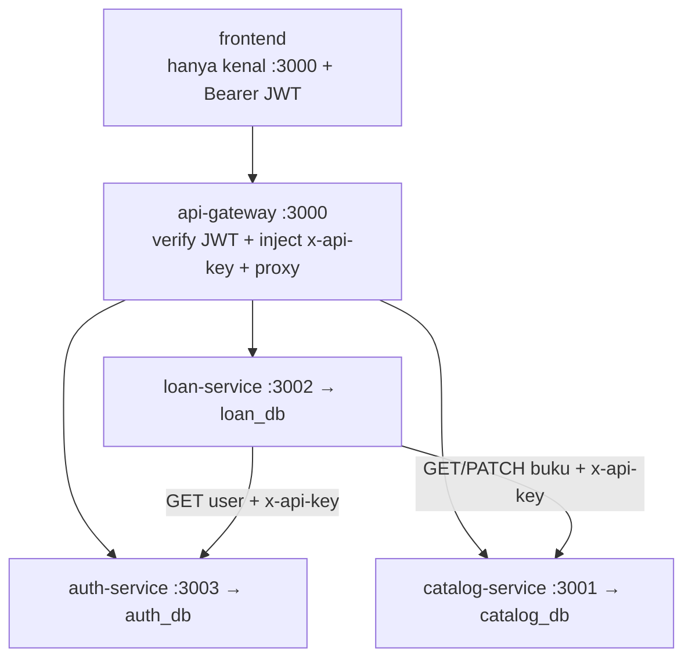

# PRD — Perbaikan Microservice Sistem Peminjaman Buku

| Field | Isi |
|---|---|
| Versi | 1.0 (2026-10-05) |
| Status | Final, siap dikerjakan |
| Repo | `vbecod` (kelompok 1) |
| Stack | Node.js + Express, MySQL lokal (XAMPP/Laragon), frontend statis, Postman |

## 1. Latar belakang & tujuan

Kondisi saat ini: `catalog-service/:3001` merangkap login + katalog (JSON), `loan-service/:3002` (JSON), frontend hit langsung ke 2 service, 1 internal key hardcoded, tanpa gateway, tanpa DB, test hanya `test.http`.

Tujuan perbaikan (sesuai kesepakatan):

1. Login/logout pindah ke `auth-service` sendiri.
2. Semua service di belakang 1 API Gateway; frontend hanya kenal gateway.
3. Tiap service pakai API Key sendiri.
4. Tiap service pakai database MySQL sendiri.
5. Pengujian via Postman (2 file: collection + environment).

## 2. Scope

Masuk: 4 service + gateway + 3 DB + frontend single-gateway + Postman + update README/arsitektur.
Tidak masuk: register user baru, blacklist/logout server-side (disepakati stateless), Docker/K8s, CI/CD, rate-limit advance.

## 3. Arsitektur final



| Komponen | Port | DB | Tanggung jawab |
|---|---|---|---|
| `api-gateway` | 3000 | — | Satu pintu frontend, verify JWT, inject API Key, proxy |
| `catalog-service` | 3001 | `catalog_db` | Murni katalog buku |
| `loan-service` | 3002 | `loan_db` | Sirkulasi pinjam/return, maks 3, +7 hari |
| `auth-service` | 3003 | `auth_db` | Login/logout/me + data user |
| `frontend` | via `npx serve` | — | Hanya panggil gateway |

Routing gateway:

| Masuk dari frontend | Diteruskan ke |
|---|---|
| `POST /api/auth/login`, `POST /api/auth/logout`, `GET /api/auth/me`, `GET /api/users/:id` | `auth-service` |
| `GET /api/books`, `GET /api/books/:id` | `catalog-service` |
| `POST/GET /api/loans*` | `loan-service` |
| `GET /health` | Agregat cek 3 service |

Publik tanpa JWT hanya: `POST /api/auth/login`, `GET /health`. Sisanya wajib `Authorization: Bearer <JWT>`.

## 4. Kontrak API (via gateway)

### 4.1 Auth
* `POST /api/auth/login {nim, password}` → `200 {success, user:{id,name}, token}` / `400` body kosong / `401` salah.
* `POST /api/auth/logout` → butuh Bearer valid → `200 {success:true}`. **Stateless: tidak ada blacklist.** Logout = server balas 200 + frontend hapus token dari `sessionStorage`. Token tetap valid sampai expired (lihat §6).
* `GET /api/auth/me` → butuh Bearer → `200 {user}` / `401`.
* `GET /api/users/:id` → internal (gateway teruskan + loan-service panggil langsung dengan `AUTH_API_KEY`) → `200 {user:{id,name}}` / `404`.

### 4.2 Catalog (via gateway, GET publik-butuh-JWT)
* `GET /api/books` → `200 {books[]}`.
* `GET /api/books/:id` → `200 {book}` / `404`.
* `PATCH /api/books/:id {status}` → **internal saja, jangan diekspos publik di gateway**. Loan-service memanggil langsung dengan `x-api-key: CATALOG_API_KEY`.

### 4.3 Loan (via gateway, semua butuh JWT)
* `POST /api/loans {studentId, bookId}` → `201 {loan}` / `400` (body kurang / kuota penuh) / `404` (user/buku) / `409` (borrowed) / `503` (katalog/auth down).
* `GET /api/loans?studentId=` → `200 {loans[] + title}`.
* `POST /api/loans/:id/return` → `200` / `404` / `503` (gagal PATCH → loan dikembalikan/rollback).

Standar error: `{success:false, message}`. Kode dipertahankan dari implementasi sekarang.

## 5. Struktur proyek final

```
vbecod/
├── api-gateway/            # BARU :3000
│   ├── server.js
│   ├── middleware/verifyJwt.js
│   ├── routes/proxy.js
│   ├── package.json        # express, http-proxy-middleware, cors, jsonwebtoken, dotenv
│   ├── .env / .env.example
├── auth-service/           # BARU :3003 → auth_db
│   ├── server.js
│   ├── routes/auth.js
│   ├── middleware/apiKey.js
│   ├── db.js               # pool mysql2 → auth_db
│   ├── schema.sql / seed.sql
│   ├── package.json        # + bcryptjs, jsonwebtoken, mysql2
│   ├── .env / .env.example
├── catalog-service/        # UBAH :3001 → catalog_db
│   ├── server.js           # hapus route users/login
│   ├── routes/books.js     # kunci x-api-key baru
│   ├── middleware/apiKey.js# BARU
│   ├── db.js               # BARU (ganti routes/store.js)
│   ├── schema.sql / seed.sql
│   ├── data/               # arsip JSON lama
│   ├── .env / .env.example
├── loan-service/           # UBAH :3002 → loan_db
│   ├── server.js
│   ├── routes/loans.js     # logic tetap, JSON → SQL
│   ├── services/catalogClient.js  # UBAH: tambah x-api-key
│   ├── services/authClient.js     # BARU: GET user via auth-service
│   ├── middleware/apiKey.js# BARU
│   ├── db.js               # BARU (ganti routes/store.js)
│   ├── schema.sql
│   ├── .env / .env.example
├── frontend/
│   ├── index.html / style.css (tetap)
│   └── script.js           # UBAH: satu gatewayBaseUrl + Bearer
├── postman/                # BARU
│   ├── Perpustakaan-Gateway.postman_collection.json
│   └── Local.postman_environment.json
├── docs/architecture.md    # UBAH
├── test.http               # dipertahankan, tandai deprecated
└── README.md               # UBAH
```

## 6. Auth & API Key (keputusan kunci)

* **JWT:** `jsonwebtoken`, secret sama di `auth-service` + `gateway` (`JWT_SECRET`), expiry **2 jam**, payload `sub=nim`. Gateway verify tiap request proteksi lalu inject `x-user-id` ke downstream. Downstream tidak perlu verify JWT (cukup cek API Key + percaya `x-user-id` dari gateway) — dengan syarat direct call tanpa API Key selalu ditolak.
* **Logout stateless (disepakati):** tanpa tabel blacklist. Kendala: token curian masih bisa dipakai sampai expired. Mitigasi: expiry pendek 2 jam, `.env` jangan di-commit, tulis keterbatasan di laporan.
* **API Key:** 3 key independen, header tunggal `x-api-key` (gantikan `x-internal-key` lama). Frontend tidak tahu key. Gateway simpan 3 key dan inject sesuai tujuan. Antar-service bawa key via env masing-masing. Direct tanpa key → `401`. Generate saat build, contoh 32 char hex.
* **Password:** `bcryptjs` (cost 10). Hash di bawah untuk `123456` dipakai di `seed.sql` agar semua laptop seragam:
  `$2b$10$SNRuY3RvWGT7IVtdOxqDaePjeYduQppDYDyg/qSLySm0UUf5rIPQ2`

## 7. Database (MySQL XAMPP/Laragon, 1 server — 3 DB)

Koneksi standar semua laptop: `host=localhost, port=3306, user=root, password=(kosong)`. Tiap service hanya boleh akses DB-nya (gunakan user root lokal untuk praktikum, tapi `db.js` tiap service menunjuk ke 1 `DB_NAME` saja).

### 7.1 `auth-service/schema.sql`
```sql
CREATE DATABASE IF NOT EXISTS auth_db CHARACTER SET utf8mb4;
USE auth_db;
CREATE TABLE IF NOT EXISTS users (
  id VARCHAR(20) PRIMARY KEY,
  name VARCHAR(100) NOT NULL,
  password_hash VARCHAR(255) NOT NULL
) ENGINE=InnoDB;
```

### 7.2 `auth-service/seed.sql`
```sql
USE auth_db;
INSERT INTO users (id, name, password_hash) VALUES
('MHS001','Ahmad Fadil','$2b$10$SNRuY3RvWGT7IVtdOxqDaePjeYduQppDYDyg/qSLySm0UUf5rIPQ2'),
('MHS002','Budi Santoso','$2b$10$SNRuY3RvWGT7IVtdOxqDaePjeYduQppDYDyg/qSLySm0UUf5rIPQ2'),
('MHS003','Citra Dewi','$2b$10$SNRuY3RvWGT7IVtdOxqDaePjeYduQppDYDyg/qSLySm0UUf5rIPQ2')
ON DUPLICATE KEY UPDATE name=VALUES(name);
```
> Hash di atas = `123456`. Jika ingin password beda, generate: `node -e "console.log(require('bcryptjs').hashSync('PASS',10))"`.

### 7.3 `catalog-service/schema.sql`
```sql
CREATE DATABASE IF NOT EXISTS catalog_db CHARACTER SET utf8mb4;
USE catalog_db;
CREATE TABLE IF NOT EXISTS books (
  id VARCHAR(10) PRIMARY KEY,
  title VARCHAR(255) NOT NULL,
  author VARCHAR(255) NOT NULL,
  category VARCHAR(100) DEFAULT 'Umum',
  status ENUM('available','borrowed') NOT NULL DEFAULT 'available'
) ENGINE=InnoDB;
```

### 7.4 `catalog-service/seed.sql` (12 buku dari `books.json` saat ini)
```sql
USE catalog_db;
INSERT INTO books (id, title, author, category, status) VALUES
('B001','Pemrograman Web','Andi Setiawan','Pemrograman','available'),
('B002','Basis Data','Rina Wati','Basis Data','available'),
('B003','Jaringan Komputer','Dedi Kurniawan','Jaringan','available'),
('B004','Struktur Data dan Algoritma','Siti Nurhaliza','Pemrograman','available'),
('B005','Sistem Operasi','Bambang Susilo','Sistem','available'),
('B006','Rekayasa Perangkat Lunak','Maya Putri','Rekayasa','available'),
('B007','Kecerdasan Buatan','Fajar Rahman','AI','available'),
('B008','Keamanan Siber','Dewi Lestari','Keamanan','available'),
('B009','Machine Learning dengan Python','Agus Prasetyo','AI','available'),
('B010','Pemrograman Mobile Android','Rizky Ananda','Pemrograman','available'),
('B011','Cloud Computing','Sari Wulandari','Cloud','available'),
('B012','UI/UX Design','Gilang Ramadhan','Desain','available')
ON DUPLICATE KEY UPDATE title=VALUES(title), author=VALUES(author), category=VALUES(category);
```

### 7.5 `loan-service/schema.sql` (tanpa seed, mulai kosong)
```sql
CREATE DATABASE IF NOT EXISTS loan_db CHARACTER SET utf8mb4;
USE loan_db;
CREATE TABLE IF NOT EXISTS loans (
  id VARCHAR(50) PRIMARY KEY,
  student_id VARCHAR(20) NOT NULL,
  book_id VARCHAR(10) NOT NULL,
  borrow_date DATE NOT NULL,
  due_date DATE NOT NULL,
  INDEX idx_student (student_id),
  INDEX idx_book (book_id)
) ENGINE=InnoDB;
```

## 8. Konfigurasi `.env` (contoh, samakan antar laptop kecuali key)

```
# api-gateway/.env
PORT=3000
AUTH_URL=http://localhost:3003
CATALOG_URL=http://localhost:3001
LOAN_URL=http://localhost:3002
AUTH_API_KEY=<isi-32char>
CATALOG_API_KEY=<isi-32char>
LOAN_API_KEY=<isi-32char>
JWT_SECRET=<sama-dengan-auth-service>

# auth-service/.env
PORT=3003
DB_HOST=localhost
DB_USER=root
DB_PASSWORD=
DB_NAME=auth_db
AUTH_API_KEY=<sama-dengan-gateway>
JWT_SECRET=<sama-dengan-gateway>
JWT_EXPIRES=2h

# catalog-service/.env
PORT=3001
DB_HOST=localhost
DB_USER=root
DB_PASSWORD=
DB_NAME=catalog_db
CATALOG_API_KEY=<sama-dengan-gateway>

# loan-service/.env
PORT=3002
DB_HOST=localhost
DB_USER=root
DB_PASSWORD=
DB_NAME=loan_db
LOAN_API_KEY=<sama-dengan-gateway>
CATALOG_API_KEY=<sama-dengan-gateway>
AUTH_API_KEY=<sama-dengan-gateway>
CATALOG_SERVICE_URL=http://localhost:3001
AUTH_SERVICE_URL=http://localhost:3003
CATALOG_TIMEOUT_MS=5000
```

## 9. Frontend (1 file diubah: `script.js`)

* `APP_CONFIG = { gatewayBaseUrl: "http://localhost:3000" }` — hapus `catalogBaseUrl/loanBaseUrl`.
* `apiRequest()` selalu kirim `Authorization: Bearer <token>` (kecuali login); hapus header `x-user-id` manual.
* `login()` → `POST {gateway}/api/auth/login`; `logout()` → `POST {gateway}/api/auth/logout` best-effort lalu `clearSession()`. UI/HTML/CSS tidak berubah.

## 10. Postman (2 file dalam `postman/`)

* `Perpustakaan-Gateway.postman_collection.json` — folder: `0-Health`, `1-Auth` (login ok/401/400, me tanpa token 401, logout 200, token lama masih 200 = bukti stateless), `2-Catalog`, `3-Loans` (201/409/400/404/return), `4-Security negatif` (tanpa Bearer 401, direct `:3001/:3002/:3003` tanpa `x-api-key` 401, key lama `x-internal-key` 401). Tiap request pasang `Tests`: assert status + `pm.environment.set("jwt"/"loanId")`.
* `Local.postman_environment.json` — variabel `gateway=http://localhost:3000, jwt, studentId=MHS001, bookId=B001, loanId`.
* Import: Postman → **Import → Folder** → pilih `postman/` → pilih environment **Local** di kanan atas → Send `login` dulu → Runner dari atas ke bawah.

## 11. Cara kerja lintas perangkat (checklist tiap laptop)

1. Clone/pull repo. Start MySQL di XAMPP/Laragon.
2. Import via phpMyAdmin (urut): `auth schema → auth seed`, `catalog schema → catalog seed`, `loan schema`.
3. Copy tiap `.env.example` → `.env`, isi key/secret (minta 1 set dari ketua agar seragam).
4. Tiap service: `npm install` sekali, lalu 4 terminal: `node server.js` di `auth-service`, `catalog-service`, `loan-service`, `api-gateway`. Cek `GET :3000/health`.
5. Frontend: `npx serve frontend` (atau Live Server dari folder `frontend/`, bukan root).
6. Postman: import folder `postman/`, pilih env `Local`, login MHS001/`123456`.
7. Uji wajib: pinjam B001 → `GET books/B001` = `borrowed`; return → `available`; matikan catalog → pinjam = `503` dan loan tidak tercatat.

## 12. Fase pengerjaan (urutan eksekusi lintas perangkat)

Kerjakan berurutan Fase 0 → 6. Setiap fase selesai = di-commit + teman lain pull sebelum lanjut. Perintah verifikasi tiap fase ada di bawah.

### Fase 0 — Persiapan (semua laptop, 15 menit)
* Yang dikerjakan: start MySQL XAMPP/Laragon; `git pull`; tidak ada ubah kode.
* Verifikasi: `mysql -u root -e "SELECT VERSION();"` jalan; `node --version` jalan.
* Done: semua anggota bisa buka phpMyAdmin.

### Fase 1 — `auth-service` + `auth_db` (tugas A)
* Yang dikerjakan: buat `auth-service/` (`server.js`, `routes/auth.js`, `middleware/apiKey.js`, `db.js`, `schema.sql`, `seed.sql`, `package.json` + dep `bcryptjs,jsonwebtoken,mysql2,dotenv`), isi `.env` (`PORT=3003`, `DB_NAME=auth_db`, `AUTH_API_KEY`, `JWT_SECRET`, `JWT_EXPIRES=2h`).
* Import: `auth-service/schema.sql` lalu `seed.sql` via phpMyAdmin.
* Verifikasi (direct, pakai `x-api-key`):
  * `POST :3003/api/auth/login {nim:MHS001,password:123456}` → `200 + token`
  * `GET :3003/api/auth/me` (Bearer) → `200`
  * `POST :3003/api/auth/logout` (Bearer) → `200`
  * Tanpa `x-api-key` → `401`
* Done: 4 cek di atas lolos; commit `auth-service/`.

### Fase 2 — Catalog & Loan pindah MySQL (tugas B + C, bisa paralel)
* B — catalog: tambah `db.js`, `middleware/apiKey.js`, `schema.sql`/`seed.sql`; hapus `routes/users.js` + endpoint `/api/login`; `routes/books.js` ganti kunci ke `x-api-key == CATALOG_API_KEY`; `routes/store.js` JSON → query SQL. Import `catalog schema + seed`.
* C — loan: tambah `db.js`, `middleware/apiKey.js`, `schema.sql`; `routes/loans.js` ganti JSON → SQL (logic maks 3/+7 hari/rollback tetap); `catalogClient.js` tambah header key; buat `services/authClient.js` (GET user via auth-service + `AUTH_API_KEY`). Import `loan schema` (kosong).
* Verifikasi:
  * `GET :3001/api/books` (key) → 12 buku; `GET :3002/api/loans` (key) → `[]`
  * Pinjam langsung `POST :3002/api/loans {MHS001,B001}` → `201`, `GET :3001/api/books/B001` → `borrowed`; return → `available`
  * Restart service → data tetap ada (bukti MySQL)
* Done: JSON di `data/` tidak lagi dibaca kode; commit catalog + loan.

### Fase 3 — API Key per service (tugas B + C, lanjut Fase 2)
* Yang dikerjakan: 3 key independen di `.env` masing-masing + `requireApiKey` di semua route; hapus sisa `x-internal-key/dev-internal-key`; loan→catalog dan loan→auth bawa key via env.
* Verifikasi: `curl` tanpa `x-api-key` ke `:3001`, `:3002`, `:3003` semua → `401`; dengan key benar → `200`.
* Done: `grep -r "x-internal-key|dev-internal-key" --include="*.js" catalog-service loan-service auth-service` bersih; commit.

### Fase 4 — API Gateway `:3000` (tugas D bagian 1)
* Yang dikerjakan: buat `api-gateway/` (`server.js`, `middleware/verifyJwt.js`, `routes/proxy.js`, `.env` berisi 3 URL + 3 key + `JWT_SECRET` yang sama dengan auth).
* Aturan: publik hanya `POST /api/auth/login` + `GET /health`; sisanya verify Bearer → inject `x-user-id` + `x-api-key` → proxy. CORS hanya di gateway.
* Verifikasi:
  * `POST :3000/api/auth/login` → `200 + token`
  * `GET :3000/api/books` tanpa Bearer → `401`; dengan Bearer → `200`
  * `GET :3000/health` → `ok` + status 3 service
* Done: full flow login→katalog→pinjam→return bisa lewat `:3000` saja; commit gateway.

### Fase 5 — Frontend single-gateway (tugas D bagian 2)
* Yang dikerjakan: hanya `frontend/script.js` — `APP_CONFIG={gatewayBaseUrl:"http://localhost:3000"}`, kirim `Authorization: Bearer` tiap request (kecuali login), hapus `catalogBaseUrl/loanBaseUrl` + header `x-user-id` manual; `logout()` hit `POST /api/auth/logout` lalu `clearSession()`.
* Verifikasi: serve dari folder `frontend/` (`npx serve frontend`), login MHS001 → katalog tampil → pinjam B001 → muncul di Peminjaman Aktif → return → hilang; `grep 3001|3002 frontend/script.js` bersih.
* Done: tidak ada lagi fetch langsung ke `:3001/:3002`; commit frontend.

### Fase 6 — Postman + docs + verifikasi lintas laptop (tugas E)
* Yang dikerjakan: buat `postman/Perpustakaan-Gateway.postman_collection.json` (folder `0-Health`, `1-Auth`, `2-Catalog`, `3-Loans`, `4-Security negatif`, tiap request ada `Tests` + `pm.environment.set("jwt"/"loanId")`) + `postman/Local.postman_environment.json`; update `README.md` + `docs/architecture.md`; tandai `test.http` deprecated.
* Verifikasi per laptop (sesuai §11): import folder `postman/` → env `Local` → login → Runner atas→bawah hijau; uji wajib pinjam→borrowed→return→available + simulasi catalog mati → `503` tanpa loan nyangkut.
* Done: semua checklist §11 + acceptance §14 lolos di minimal 2 laptop berbeda; merge final.

Ringkasan ketergantungan: `0 → 1 → 2 → 3 → 4 → 5 → 6`. Jangan loncat (misal gateway Fase 4 butuh JWT secret Fase 1 + key Fase 3).

## 13. Pembagian tugas saran (paralel)

* A: `auth-service` + SQL auth.
* B: `catalog-service` MySQL + API Key.
* C: `loan-service` MySQL + `authClient`.
* D: `gateway` + `frontend/script.js`.
* E: Postman 2 file + update README/arsitektur + verifikasi lintas laptop.

Urutan merge: A → B/C → D → E.

## 14. Acceptance criteria (definisi selesai)

* [ ] Login/logout/me lewat `:3000` jalan; token JWT 2 jam.
* [ ] Frontend tidak lagi memanggil `:3001/:3002` langsung (cek `grep 3001|3002 frontend/script.js` bersih kecuali komentar).
* [ ] Direct ke `:3001/:3002/:3003` tanpa `x-api-key` → `401`.
* [ ] Data bertahan setelah restart (bukti MySQL, bukan JSON).
* [ ] Flow pinjam→borrowed→return→available + rollback `503` lolos via Postman.
* [ ] Teman sekelompok bisa setup hanya dari dokumen ini + SQL di repo.

## 15. Risiko & keterbatasan

* Logout stateless: token valid sampai expired — diterima sebagai keterbatasan proyek.
* Secret/key beda antar laptop → wajib 1 set seragam dari ketua.
* Race condition 2 peminjam bersamaan (check-then-act tanpa lock) — di luar scope, cukup didokumentasikan (sudah ada di `architecture.md`).
* `test.http` dipertahankan sebagai arsip, sumber kebenaran pengujian adalah Postman.
