# AI Coding Tool yang Digunakan

**Opencode** — AI coding tool yang digunakan selama proses pengembangan Sistem Peminjaman Buku.

## Penggunaan AI

Berikut alur penggunaan AI selama pengembangan, mulai dari perencanaan (plan), pembangunan service, integrasi, adaptasi frontend, hingga penanganan bug.

| Tahap | Prompt | Hasil |
|-------|--------|-------|
| **Plan migrasi** — merancang migrasi dari monolitik ke arsitektur microservice | 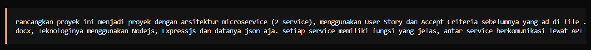 | 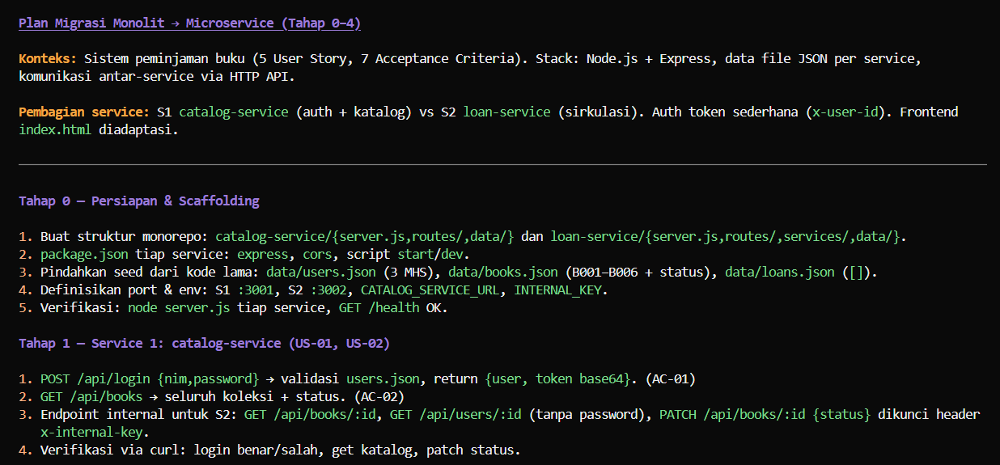 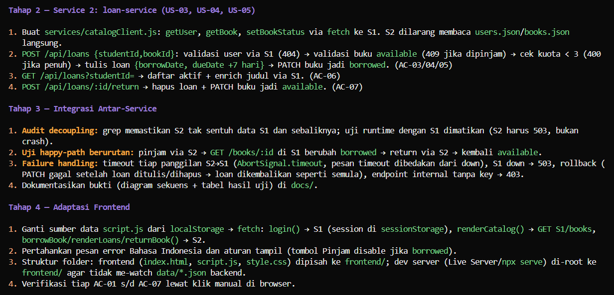 |
| **Catalog service** — membangun service katalog (login, buku, pengguna) | 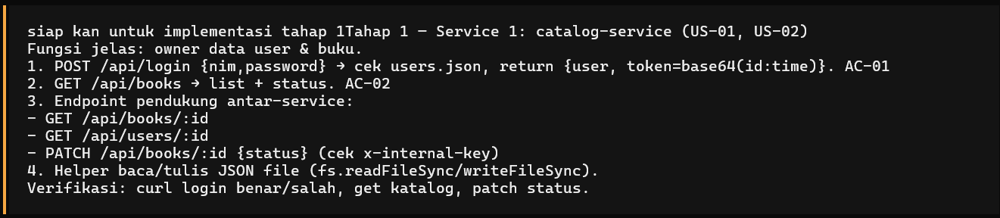 | — |
| **Loan service** — membangun service peminjaman | 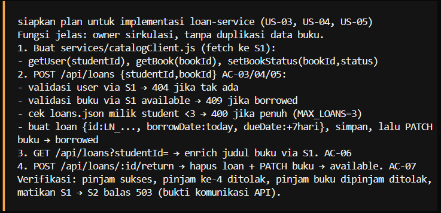 | — |
| **Integrasi antar service** — menghubungkan catalog-service dengan loan-service | 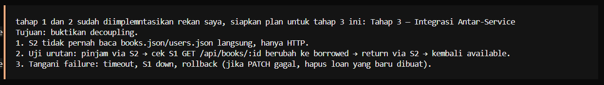 | — |
| **Adaptasi frontend** — mengubah frontend agar menggunakan API dari service | 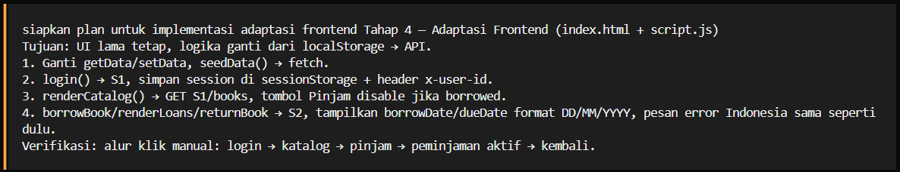 | — |
| **Redesign UI** — perombakan tampilan antarmuka pengguna | 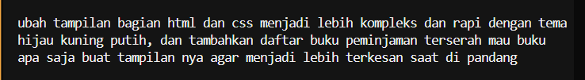 | — |
| **Bug web blank/double refresh** — setiap aksi web tampil kosong/double refresh; hasil analisis AI: *Bug ditemukan (bukan masalah kode, hanya masalah live server)* | 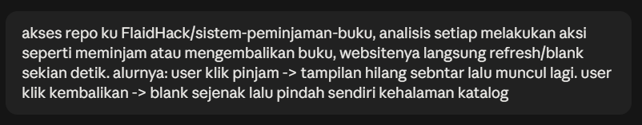 | 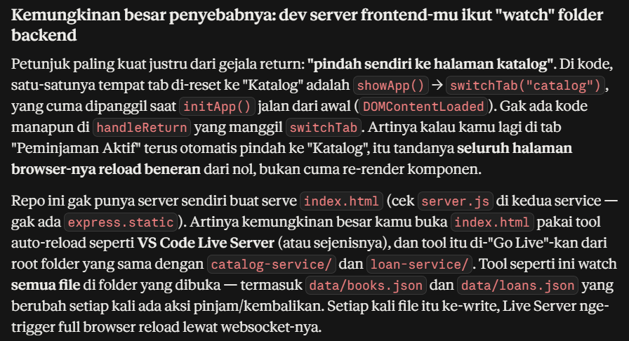 Rekomendasi perbaikan dari AI: 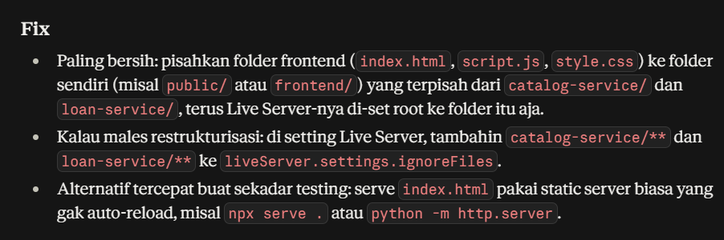 |
| **Perbaikan bug live server** — prompt perbaikan dengan memindahkan kode UI utama (`index.html`, `style.css`, `script.js`) ke dalam folder `frontend` agar dapat dijalankan live server melalui folder `frontend`, bukan root proyek | 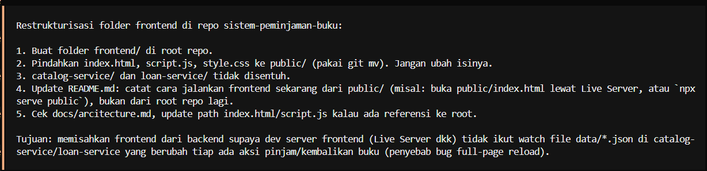 | — |

Tabel di atas dirangkum sebagai alur berikut:

1. **Plan Migrasi** — meminta AI merencanakan migrasi arsitektur (hasil: `hasil1.png`, `hasil2.png`).
2. **Catalog Service** — membangun service katalog.
3. **Loan Service** — membangun service peminjaman.
4. **Integrasi antar Service** — menghubungkan kedua service.
5. **Adaptasi Frontend** — frontend memakai API dari service.
6. **Redesign UI** — pembaruan tampilan antarmuka.
7. **Debugging Bug Blank/Double Refresh** — AI menganalisis penyebab bug dan memberi rekomendasi perbaikan.
8. **Perbaikan Bug Live Server** — memindahkan `index.html`, `style.css`, `script.js` ke folder `frontend` agar live server berjalan dari `frontend`, bukan root proyek.

## Bagaimana AI Membantu Proses Pengembangan

1. **Mempercepat proses kerja** — kode untuk service, endpoint, dan frontend dapat dibuat dengan cepat tanpa perlu mengetik dari nol, sehingga fitur selesai dalam waktu yang jauh lebih singkat.

2. **Membantu efisiensi waktu dan tenaga** — tugas yang berulang dan memakan waktu, seperti pembuatan struktur file, penulisan kode standar, dan pengaturan konfigurasi, dikerjakan otomatis sehingga tenaga tim dapat difokuskan pada logika bisnis.

3. **Membantu mengevaluasi kesalahan/debugging** — saat muncul bug (misalnya web blank/double refresh), AI membantu menganalisis penyebab masalah dan memberikan rekomendasi perbaikan, mempercepat proses identifikasi dan solusi error.

4. **Perancangan dan struktur project** — AI membantu merancang struktur proyek, seperti rencana migrasi ke arsitektur microservice, pembagian folder `catalog-service`, `loan-service`, dan `frontend`, sehingga struktur tetap rapi dan mudah dikembangkan.

5. **Analisis dan refactoring kode** — AI mampu memeriksa kode yang ada untuk menemukan bagian yang kurang efisien atau kurang sesuai, lalu menyusun ulang (refactor) agar lebih bersih, konsisten, dan mudah dipelihara.

6. **Membantu pembuatan dokumentasi** — dokumentasi seperti README, arsitektur, dan catatan penggunaan AI dapat disusun dengan bantuan AI, sehingga dokumentasi proyek tetap lengkap dan mudah dipahami anggota tim.