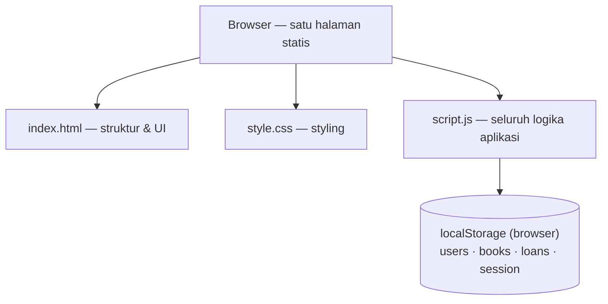
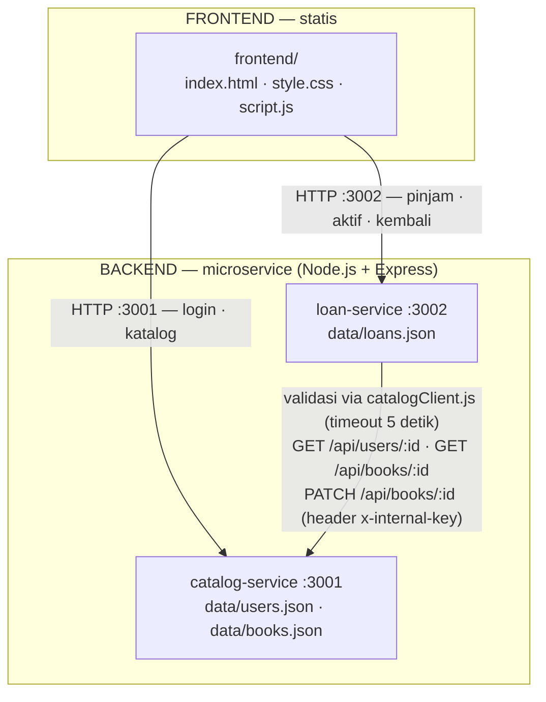

# Arsitektur Sistem Peminjaman Buku

Dokumentasi ini menjelaskan perjalanan arsitektur sistem: mulai dari **arsitektur monolitik**
(sebelum dikembangkan) hingga **arsitektur microservice** (kondisi saat ini).

## 1. Arsitektur Sebelum — Monolitik

Pada tahap awal, aplikasi hanya berupa **satu halaman web statis** yang disusun dari tiga file
yang berada di root proyek:

- `index.html` — struktur dan tampilan antarmuka (halaman login, katalog buku, dan peminjaman aktif).
- `style.css` — styling/desain antarmuka.
- `script.js` — seluruh logika aplikasi: login, katalog, peminjaman, pengembalian, hingga data.

Tidak ada backend, tidak ada API, dan tidak ada pemisahan layanan. Semua data disimpan di
**localStorage** browser (key `users`, `books`, `loans`, `session`), dengan seed data
(pengguna & buku) yang ditulis langsung (hardcoded) di dalam `script.js`. Validasi aturan
bisnis (maksimal 3 pinjaman aktif, jatuh tempo +7 hari, buku yang dipinjam tidak tersedia)
juga dilakukan sepenuhnya di sisi klien.

| Karakteristik | Keterangan |
|---------------|------------|
| Struktur | 3 file statis (HTML, CSS, JS) di root |
| Penyimpanan data | `localStorage` browser |
| Logika bisnis | Di dalam `script.js` (client-side) |
| Backend / API | Tidak ada |
| Skalabilitas | Rendah — semua dalam satu bundle |

## 2. Arsitektur Sesudah — Microservice

Untuk mengatasi keterbatasan arsitektur monolitik, sistem dikembangkan menjadi arsitektur
**microservice**: dua service backend yang terpisah dan berkomunikasi lewat HTTP REST API,
dengan frontend statis yang mengonsumsi API dari service tersebut.

### Diagram Arsitektur Microservice

| Bagian | Teknologi | Port | Kepemilikan data |
|--------|-----------|------|------------------|
| `frontend/` | HTML, CSS, JavaScript (statis) | via Live Server / `npx serve` | — |
| `catalog-service` | Node.js + Express | 3001 | `data/users.json`, `data/books.json` |
| `loan-service` | Node.js + Express | 3002 | `data/loans.json` |

Perbedaan utama dengan arsitektur sebelumnya:

- Data berpindah dari `localStorage` browser ke **file JSON per service**.
- Setiap service memiliki data dan tanggung jawabnya sendiri (**data terisolasi**).
- Komunikasi antar-service dilakukan lewat HTTP API, bukan akses file langsung.
- Validasi aturan bisnis dipindahkan ke sisi **server** (`loan-service`).

## 3. Detail Microservice

Dua service, komunikasi antar-service lewat HTTP API. Data terisolasi per service (file JSON
masing-masing) — lihat diagram arsitektur di [bagian 2](#2-arsitektur-sesudah--microservice).

* **catalog-service (:3001)** — owner `users.json` + `books.json`. Endpoint: `POST /api/login`,
  `GET /api/books`, `GET /api/books/:id`, `GET /api/users/:id`,
  `PATCH /api/books/:id` (dikunci header `x-internal-key`, hanya untuk loan-service).
* **loan-service (:3002)** — owner `loans.json`. Tidak pernah membaca `users.json`/`books.json`
  langsung; semua validasi via `services/catalogClient.js` (`fetch` ke S1, timeout 5 detik
  via `AbortSignal.timeout`, bisa dioverride dengan env `CATALOG_TIMEOUT_MS`).
  Endpoint: `POST /api/loans`, `GET /api/loans?studentId=`, `POST /api/loans/:id/return`.
* Aturan bisnis (di S2): maks 3 pinjaman aktif (`400`), buku `borrowed` ditolak (`409`),
  jatuh tempo +7 hari. Gagal hubungi S1 → `503` (pesan dibedakan: "tidak tersedia" vs "timeout").
  Jika PATCH status buku gagal setelah loan ditulis/dihapus, S2 rollback (hapus/kembalikan loan).

## 4. Alur pinjam (sequence)

1. `POST :3002/api/loans {studentId, bookId}`
2. S2 → `GET :3001/api/users/{id}` (user ada?)
3. S2 → `GET :3001/api/books/{id}` (status `available`? kuota < 3?)
4. S2 tulis loan ke `loans.json`, lalu → `PATCH :3001/api/books/{id} {borrowed}`
5. PATCH gagal → loan dihapus lagi (rollback) + `503`

Alur return analog: hapus loan dulu, PATCH `available`, gagal → loan dikembalikan + `503`.

## 5. Bukti uji Tahap 3 (2026-09-21)

| # | Uji | Hasil |
|---|-----|-------|
| 3A | `grep users.json\|books.json` di `loan-service/*.js` | bersih (hanya komentar) |
| 3B | login MHS001 → pinjam B001 → `GET /books/B001` | `available` → `borrowed`, `dueDate` +7 hari (21→28 Sep 2026) |
| 3B | `GET /loans?studentId=MHS001` | 1 loan + `title: Pemrograman Web` (enrich via S1) |
| 3B | return → cek ulang | B001 `available`, loans kosong |
| 3C | S1 dimatikan, `POST /loans` | `503 Katalog service tidak tersedia`, `loans.json` tetap `[]` |
| 3C | PATCH digagalkan (key salah), `POST /loans` | `503`, loan ter-rollback, buku tetap `available` |
| 3C | `PATCH /books/:id` tanpa/salah key | `403` |
| 3C | S1 di-hang, timeout 800ms/2000ms | `TimeoutError` ~817ms; e2e `503 Katalog service timeout, coba lagi` |

Keterbatasan yang diketahui: race condition dua peminjam bersamaan untuk buku yang sama
(check-then-act tanpa lock) — di luar scope, cukup didokumentasikan.