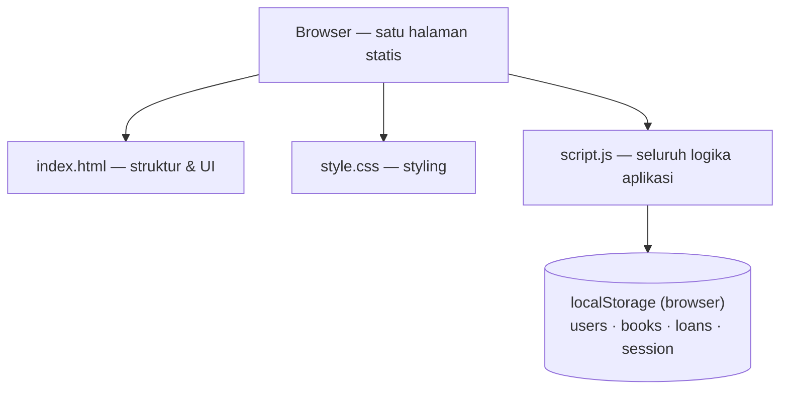
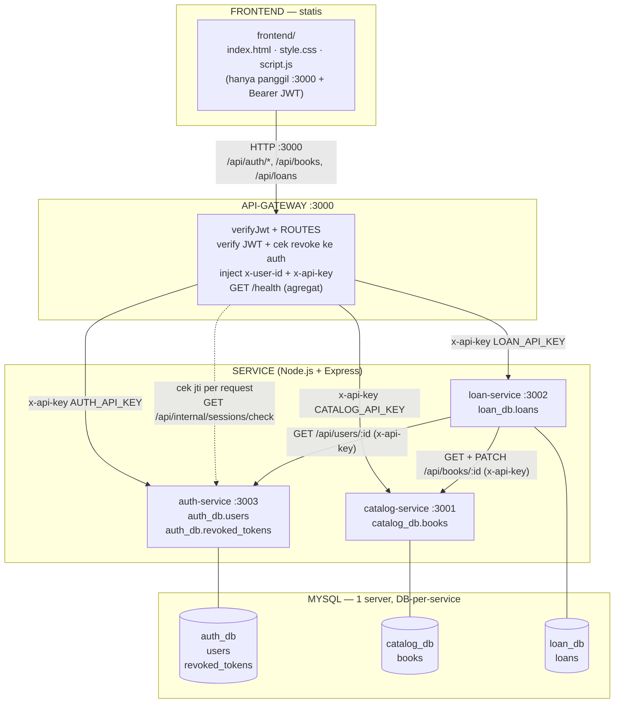

# Arsitektur Sistem Peminjaman Buku

Dokumentasi ini menjelaskan arsitektur sistem: **sebelum (monolitik)** dan
**sesudah (microservice gateway + MySQL + JWT)** yang dipakai saat ini.

## 1. Before — Monolitik

Pada tahap awal, aplikasi hanya berupa **satu halaman web statis** yang disusun dari tiga file
yang berada di root proyek:

- `index.html` — struktur dan tampilan antarmuka (halaman login, katalog buku, dan peminjaman aktif).
- `style.css` — styling/desain antarmuka.
- `script.js` — seluruh logika aplikasi: login, katalog, peminjaman, pengembalian, hingga data.

Tidak ada backend, tidak ada API, dan tidak ada pemisahan layanan. Semua data disimpan di
**localStorage** browser (key `users`, `books`, `loans`, `session`), dengan seed data
(pengguna & buku) yang ditulis langsung (hardcoded) di dalam `script.js`. Validasi aturan
bisnis (maksimal 3 pinjaman aktif, jatuh tempo +7 hari, buku yang dipinjam tidak tersedia)
juga dilakukan sepenuhnya di sisi klien.

```mermaid
flowchart TB
    B["Browser — satu halaman statis"]
    B --> HTML["index.html — struktur & UI"]
    B --> CSS["style.css — styling"]
    B --> JS["script.js — seluruh logika aplikasi"]
    JS --> LS[("localStorage (browser)<br/>users · books · loans · session")]
```

| Karakteristik | Keterangan |
|---------------|------------|
| Struktur | 3 file statis (HTML, CSS, JS) di root |
| Penyimpanan data | `localStorage` browser |
| Logika bisnis | Di dalam `script.js` (client-side) |
| Backend / API | Tidak ada |
| Skalabilitas | Rendah — semua dalam satu bundle |

## 2. After — Gateway + MySQL + JWT (saat ini)

Sistem dimigrasi ke **satu pintu api-gateway (`:3000`)**,
autentikasi **JWT + `jti` (expiry 2 jam, logout stateful via blacklist)**,
proteksi antar-service via **`x-api-key`**, dan penyimpanan **MySQL dengan
DB-per-service** (1 server, 3 database).
Frontend (`frontend/script.js`) hanya kenal `gatewayBaseUrl: http://localhost:3000`
dan mengirim `Authorization: Bearer` tiap request kecuali login.

### Diagram Arsitektur

```mermaid
flowchart TB
    subgraph FE["FRONTEND — statis"]
        UI["frontend/<br/>index.html · style.css · script.js<br/>(hanya panggil :3000 + Bearer JWT)"]
    end

    subgraph GW["API-GATEWAY :3000"]
        VFY["verifyJwt + ROUTES<br/>verify JWT + cek revoke ke auth<br/>inject x-user-id + x-api-key<br/>GET /health (agregat)"]
    end

    subgraph SVC["SERVICE (Node.js + Express)"]
        AUTH["auth-service :3003<br/>auth_db.users<br/>auth_db.revoked_tokens"]
        CAT["catalog-service :3001<br/>catalog_db.books"]
        LOAN["loan-service :3002<br/>loan_db.loans"]
    end

    subgraph DB["MYSQL — 1 server, DB-per-service"]
        ADB[("auth_db<br/>users<br/>revoked_tokens")]
        CDB[("catalog_db<br/>books")]
        LDB[("loan_db<br/>loans")]
    end

    UI -- "HTTP :3000<br/>/api/auth/*, /api/books, /api/loans" --> VFY
    VFY -- "x-api-key AUTH_API_KEY" --> AUTH
    VFY -- "x-api-key CATALOG_API_KEY" --> CAT
    VFY -- "x-api-key LOAN_API_KEY" --> LOAN
    VFY -. "cek jti per request<br/>GET /api/internal/sessions/check" .-> AUTH
    AUTH --- ADB
    CAT --- CDB
    LOAN --- LDB
    LOAN -- "GET /api/users/:id (x-api-key)" --> AUTH
    LOAN -- "GET + PATCH /api/books/:id (x-api-key)" --> CAT
```

| Bagian | Port | Kepemilikan data | Kunci akses |
|--------|------|------------------|-------------|
| `api-gateway` | 3000 | — (stateful: verify JWT + cek revoke ke auth-service) | `JWT_SECRET` + 3 API key |
| `auth-service` | 3003 | `auth_db.users` + `auth_db.revoked_tokens` | `AUTH_API_KEY` + `JWT_SECRET` |
| `catalog-service` | 3001 | `catalog_db.books` | `CATALOG_API_KEY` |
| `loan-service` | 3002 | `loan_db.loans` | `LOAN_API_KEY` (+ key catalog/auth untuk panggil service lain via `services/authClient.js` + `services/catalogClient.js`) |
| `frontend/` | via Live Server / `npx serve` | — | Bearer JWT saja (tidak tahu API key) |

Aturan yang ditegakkan gateway (`api-gateway/routes/proxy.js` + `middleware/verifyJwt.js`):
- Setiap request proteksi: `jwt.verify` lalu cek `jti` ke
  `GET :3003/api/internal/sessions/check` (header `x-api-key`). Token yang sudah
  logout → `401`; auth-service mati/timeout → `503` (fail-closed).
- Header `x-api-key`/`x-user-id` dari browser **dihapus lalu di-inject ulang** dari JWT
  yang terverifikasi (tidak bisa dipalsukan dari frontend).
- `PATCH /api/books/:id` **tidak diteruskan** (endpoint internal loan-service) → `404`.
- Direct call ke `:3001/:3002/:3003` tanpa `x-api-key` → `401`.
- Token tanpa `jti` (terbitan lama sebelum fix) → `401`, harus login ulang.

### Alur pinjam (via gateway)

1. Browser → `POST :3000/api/loans {studentId, bookId}` (`Bearer` JWT).
2. Gateway `verifyJwt` + teruskan ke `loan-service` (`x-api-key` + `x-user-id`).
3. `loan-service` → `GET :3003/api/users/{id}` (user ada?) via `services/authClient.js`.
4. `loan-service` → `GET :3001/api/books/{id}` (status `available`? kuota < 3?) via `services/catalogClient.js`.
5. `loan-service` tulis loan ke `loan_db.loans`, lalu → `PATCH :3001/api/books/{id} {borrowed}`.
6. PATCH gagal → loan di-rollback + `503`. Return analog (`available`).

Keterbatasan yang diketahui: race condition dua peminjam bersamaan untuk buku yang sama
(check-then-act tanpa lock) — di luar scope, cukup didokumentasikan.

### DB-per-service

Satu server MySQL lokal (`localhost:3306, root, password kosong`), tiap service hanya
membuka **satu `DB_NAME`** miliknya (`auth-service/db.js` → `auth_db`, dst.).
Tidak ada join lintas DB dan tidak ada akses file/data service lain:
`loan-service` memvalidasi user & buku murni lewat HTTP ke auth/catalog-service.
Skema final terdefinisi di `auth-service/{schema,seed}.sql` (termasuk tabel
`revoked_tokens` untuk blacklist logout), `catalog-service/{schema,seed}.sql`,
`loan-service/schema.sql` (diimport via phpMyAdmin, urut: schema → seed per service).

### Catatan logout stateful (blacklist jti)

`POST /api/auth/logout` me-revoke JWT via tabel `auth_db.revoked_tokens(jti, user_id, expires_at)`:
login menerbitkan `jti` (UUID), logout `INSERT IGNORE` jti tersebut, `GET /api/auth/me`
dan `api-gateway/middleware/verifyJwt.js` menolak jti yang ada di blacklist (`401`).
Gateway mengecek via `GET /api/internal/sessions/check?jti=` (header `x-api-key`)
sehingga token lama ditolak di **semua** endpoint (`/me`, `/books`, `/loans`).
Bukti: request Postman `1-Auth / Me token lama setelah logout → 401 (revoked)`.
Token tanpa `jti` (terbitan lama) ditolak `401` dan harus login ulang.

### Verifikasi Fase 6

Pengujian sumber-kebenaran memakai Postman: `postman/Perpustakaan-Gateway.postman_collection.json`
(folder `0-Health`, `1-Auth`, `2-Catalog`, `3-Loans`, `4-Security negatif`, tiap request
ada `Tests` + `pm.environment.set("jwt"/"loanId")`) dengan environment `postman/Local.postman_environment.json`.
Uji wajib per laptop: `GET :3000/health` → login MHS001 → pinjam B001 (`borrowed`) →
return (`available`), plus simulasi catalog mati → `503` tanpa loan nyangkut.
Lihat [README](../README.md) (cara run 4 service + import Postman).
